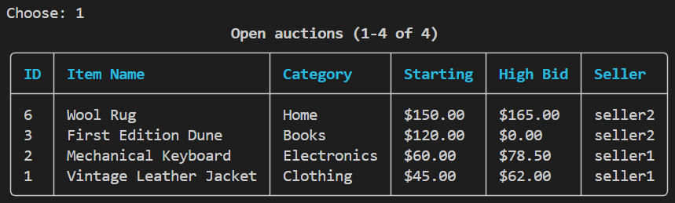
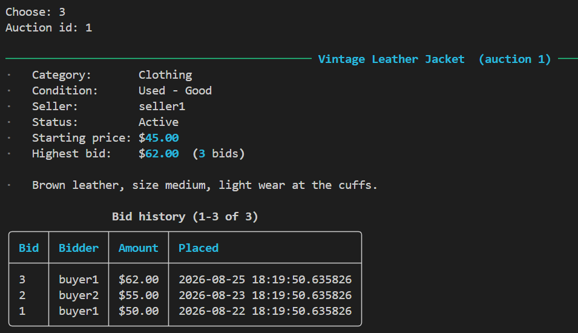
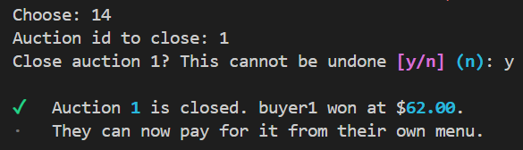
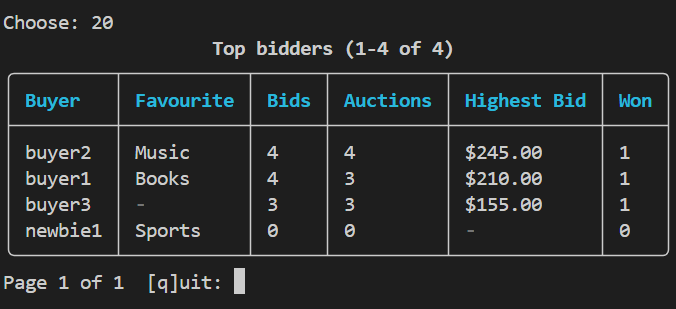
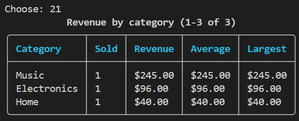
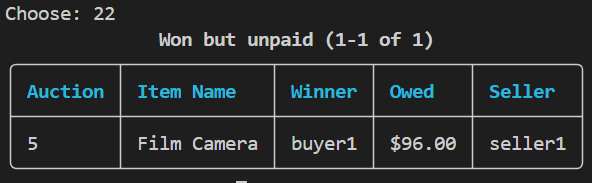
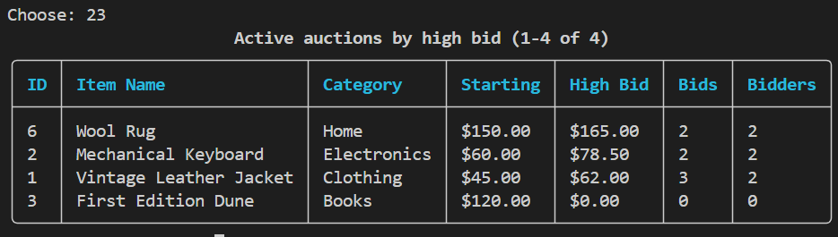

# CS166 - Phase 3: eBay Project

1. Overview

Our project delivers a terminal-based “eBay” project. It is built using Python, PostgreSQL, and Rich. This project models real-world e-commerce operations including authentication, multi-role interfaces (buyer, seller, etc.), bidding, payment handling, and order fulfillment.

Key system features and structural highlights include:
- Role-Based Access & Security: Enforces distinct workflows for Buyers, Sellers, and Admins using Session state management and explicit require_role() authorization gates.
- Database Architecture & Custom Extensions: Houses data across six core tables (users, item, auction, bid, payment, and shipment). Uses custom sequences and RETURNING clauses for primary key generation across numeric entities.
- Transactional Integrity: Enforces row-level locking (FOR UPDATE) and transaction semantics on critical operations like bid placement to maintain consistent state across concurrent user actions.
- Modular Codebase: Separates backend execution, custom exceptions (src/errors.py), database handling (src/db.py), interactive UI styling (src/ui.py), and role-specific action menus under src/menus/.
- Reproducible Deployment: Managed via uv package synchronization and scripted database builds (scripts/load_db.py) using raw SQL schemas, extensions, and seed data.

2. Implemented Functions

Authentication & Session Management (src/auth.py)
- register(login, password, name, email): Registers a new user account in the users table with default role Buyer
- login(login, password): Authenticates credentials against the database and initializes an active Session state
- require_role(allowed_roles): Authorization decorator/gate verifying that the current active session possesses the required permission level before executing sensitive menu options

Auctions & Browsing (src/auctions.py)
- browse_open_auctions(): Queries active listings in the auction table joined with item metadata, featuring built-in terminal pagination
- search_auctions(keyword): Filters active auctions matching a given search term across item titles or descriptions
- get_auction_details(auction_id): Fetches complete state for a specific auction, including current highest bid, seller information, and end time
- end_auction(auction_id): Closes an expired auction, determines the winning bid, and triggers the creation of payment/shipment obligations

Bidding Operations (src/bids.py)
- place_bid(auction_id, buyer_login, bid_amount): Executes a bid placement within a single transaction using explicit FOR UPDATE row-level locks on the target auction to prevent race conditions. Enforces five core validation rules (e.g., bid > current high, active auction status, non-seller bid)
- get_bid_history(buyer_login): Retrieves all historical bids placed by the specified buyer along with auction outcomes

Items & Listings (src/items.py)
- create_listing(seller_login, title, description, starting_price): Creates an item entry and opens a corresponding record in auction

Fulfillment & Payments (src/payments.py, src/shipments.py)

- process_payment(auction_id, buyer_login, payment_details): Records a transaction payment entry upon winning an auction
- create_shipment(payment_id, tracking_info): Generates fulfillment tracking details for paid orders

User & Admin Operations (src/users.py & src/reports.py)

- update_profile(login, details): Updates user profile information
- change_user_role(target_login, new_role): Admin-only action to elevate or adjust access privileges across Buyer, Seller, or Admin
- top_bidders(session): Admin-only, returns every Buyer and how much bidding they have done
- revenue_by_category(session): Admin-only, returns each category that has sold at least one item and its corresponding revenue
- unpaid_wins(session): Admin-only, returns a list of auctions that were won but never paid for
- active_auctions(session): Admin-only, returns every open auction and its corresponding bidding activity

3. Screenshots

Browse open auctions:

View an auction in detail:

Closing one of your auctions:

Top bidders:

Revenue by category:

Won but unpaid:

Active auctions by high bid:

4. Contributions

Jorge: Code, repository

Haripriya: Final project report

Celina: Demo, final project report